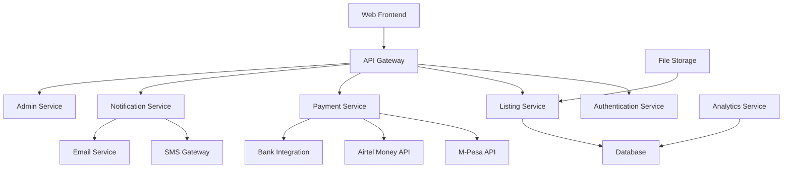

# CarRescueKe Platform Design Document

## Overview

CarRescueKe is a web-based marketplace platform specifically designed for the Kenyan market to facilitate private treaty sales of distressed vehicles. The platform operates on a pay-to-list model where sellers pay 2500 KES to make their listings public, generating revenue for the platform operator while ensuring listing quality.

The platform integrates with Kenyan mobile money services (M-Pesa, Airtel Money) and uses local payment infrastructure to process the 2500 KES listing fees through Paybill No: 714777, A/c No: 0101355308.

## Architecture

### System Architecture



### Technology Stack

- **Frontend**: React.js with TypeScript for responsive web application
- **Backend**: Node.js with Express.js framework
- **Database**: PostgreSQL for relational data with Redis for caching
- **Payment Integration**: M-Pesa Daraja API, Airtel Money API
- **File Storage**: AWS S3 or local storage for vehicle images
- **Authentication**: JWT-based authentication with bcrypt password hashing
- **Notifications**: Twilio for SMS, SendGrid for email
- **Deployment**: Docker containers with nginx reverse proxy

## Components and Interfaces

### 1. User Management Component

**Interfaces:**
- User registration and authentication
- Profile management
- Role-based access (Seller, Buyer, Admin)

**Key Features:**
- Kenyan phone number validation (+254 format)
- ID number validation for sellers
- Password reset via SMS
- User verification status

### 2. Vehicle Listing Component

**Interfaces:**
- Listing creation and management
- Image upload and processing
- Search and filtering
- Listing status management (Draft, Pending Payment, Active, Expired)

**Key Features:**
- Multi-image upload with compression
- Vehicle details form with Kenyan-specific fields
- Location selection using Kenyan counties
- Listing expiration management (30-day default)

### 3. Payment Processing Component

**Interfaces:**
- Payment gateway integration
- Transaction tracking
- Revenue management

**Payment Configuration:**
```javascript
const PAYMENT_CONFIG = {
  paybillNumber: "714777",
  accountNumber: "0101355308",
  listingFee: 2500, // KES
  currency: "KES"
};
```

**Key Features:**
- M-Pesa STK Push integration
- Airtel Money payment processing
- Payment verification and callback handling
- Automatic listing activation upon payment confirmation
- Transaction history and receipts

### 4. Search and Discovery Component

**Interfaces:**
- Advanced search functionality
- Filtering and sorting
- Listing recommendations

**Key Features:**
- Search by make, model, year, price range
- Location-based filtering (county/town)
- Price range filtering in KES
- Sorting by price, date, popularity

### 5. Communication Component

**Interfaces:**
- Buyer-seller messaging
- Notification system
- Contact management

**Key Features:**
- In-platform messaging system
- SMS notifications for inquiries
- Email notifications for important updates
- Phone number masking for privacy

### 6. Admin Dashboard Component

**Interfaces:**
- Revenue analytics
- User management
- Listing moderation
- System monitoring

**Key Features:**
- Real-time revenue tracking
- Payment reconciliation
- User account management
- Content moderation tools

## Data Models

### User Model
```typescript
interface User {
  id: string;
  email: string;
  phoneNumber: string; // +254 format
  firstName: string;
  lastName: string;
  idNumber?: string; // For sellers
  role: 'buyer' | 'seller' | 'admin';
  isVerified: boolean;
  createdAt: Date;
  updatedAt: Date;
}
```

### Vehicle Listing Model
```typescript
interface VehicleListing {
  id: string;
  sellerId: string;
  make: string;
  model: string;
  year: number;
  mileage: number;
  price: number; // In KES
  description: string;
  condition: 'excellent' | 'good' | 'fair' | 'poor';
  location: {
    county: string;
    town: string;
  };
  images: string[]; // URLs to uploaded images
  status: 'draft' | 'pending_payment' | 'active' | 'expired' | 'sold';
  paymentId?: string;
  createdAt: Date;
  expiresAt: Date;
  updatedAt: Date;
}
```

### Payment Transaction Model
```typescript
interface PaymentTransaction {
  id: string;
  userId: string;
  listingId: string;
  amount: number; // 2500 KES
  currency: 'KES';
  paymentMethod: 'mpesa' | 'airtel_money' | 'bank_transfer';
  transactionId: string; // From payment provider
  status: 'pending' | 'completed' | 'failed' | 'refunded';
  paybillNumber: '714777';
  accountNumber: '0101355308';
  createdAt: Date;
  completedAt?: Date;
}
```

### Message Model
```typescript
interface Message {
  id: string;
  listingId: string;
  senderId: string;
  receiverId: string;
  content: string;
  isRead: boolean;
  createdAt: Date;
}
```

## Error Handling

### Payment Error Handling
- **Payment Timeout**: Retry mechanism with exponential backoff
- **Insufficient Funds**: Clear error message with payment alternatives
- **Network Issues**: Queue payments for retry when connection restored
- **Invalid Payment Details**: Validation before payment initiation

### Listing Error Handling
- **Image Upload Failures**: Retry mechanism with progress indication
- **Validation Errors**: Real-time form validation with clear error messages
- **Duplicate Listings**: Detection and prevention mechanisms
- **Expired Listings**: Automatic status updates with renewal notifications

### System Error Handling
- **Database Failures**: Connection pooling with failover
- **API Rate Limits**: Request queuing and throttling
- **Authentication Errors**: Secure session management with automatic logout
- **File Storage Issues**: Backup storage options and error recovery

## Testing Strategy

### Unit Testing
- **Payment Processing**: Mock payment gateway responses
- **User Authentication**: Test JWT token generation and validation
- **Data Validation**: Test all input validation rules
- **Business Logic**: Test listing status transitions and fee calculations

### Integration Testing
- **Payment Gateway Integration**: Test with sandbox environments
- **SMS/Email Services**: Test notification delivery
- **Database Operations**: Test CRUD operations and transactions
- **File Upload**: Test image processing and storage

### End-to-End Testing
- **User Registration Flow**: Complete seller onboarding process
- **Listing Creation**: From draft to active listing with payment
- **Search and Discovery**: Buyer journey from search to contact
- **Admin Operations**: Revenue tracking and user management

### Performance Testing
- **Load Testing**: Simulate concurrent users and transactions
- **Payment Processing**: Test payment gateway under load
- **Image Upload**: Test multiple concurrent file uploads
- **Database Performance**: Test query performance with large datasets

### Security Testing
- **Payment Security**: Test transaction integrity and fraud prevention
- **Authentication**: Test session management and access controls
- **Data Protection**: Test PII handling and storage security
- **Input Validation**: Test against injection attacks and XSS

## Kenyan Market Specific Features

### Payment Integration
- M-Pesa Daraja API integration for STK Push payments
- Airtel Money API for alternative mobile money option
- Bank transfer option for users without mobile money
- Payment confirmation via SMS in English and Swahili

### Localization
- Currency display in KES with proper formatting
- Kenyan county and town selection dropdowns
- Phone number validation for +254 format
- ID number validation for Kenyan national IDs

### Marketing and Growth
- Referral program with bonus listings
- Social media sharing with WhatsApp integration
- SMS marketing campaigns for user acquisition
- Partnership opportunities with car dealers and financial institutions

## Revenue Model

### Primary Revenue Stream
- 2500 KES listing fee per vehicle (paid to Paybill 714777, A/c 0101355308)
- Automatic revenue tracking and reconciliation
- Monthly revenue reporting and analytics

### Additional Revenue Opportunities
- Premium listing features (featured placement, extended duration)
- Advertising space for automotive services
- Commission on successful sales (optional future feature)
- Subscription model for high-volume sellers